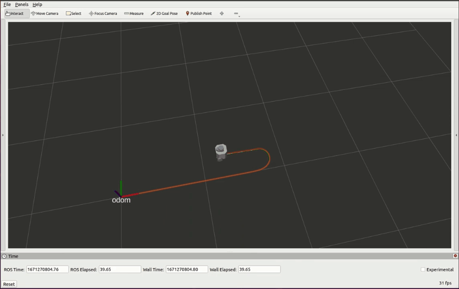
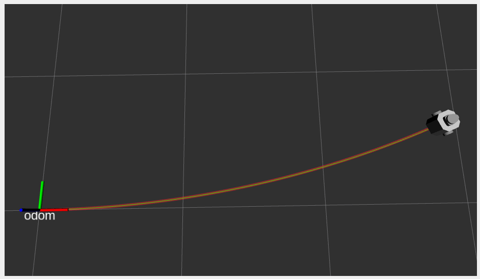
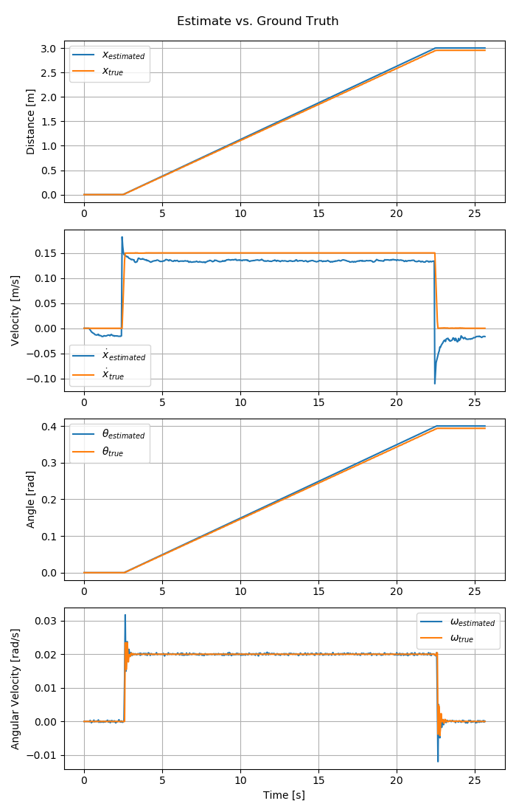
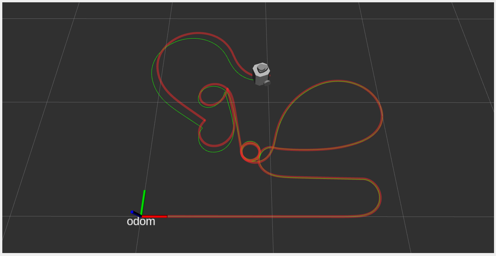
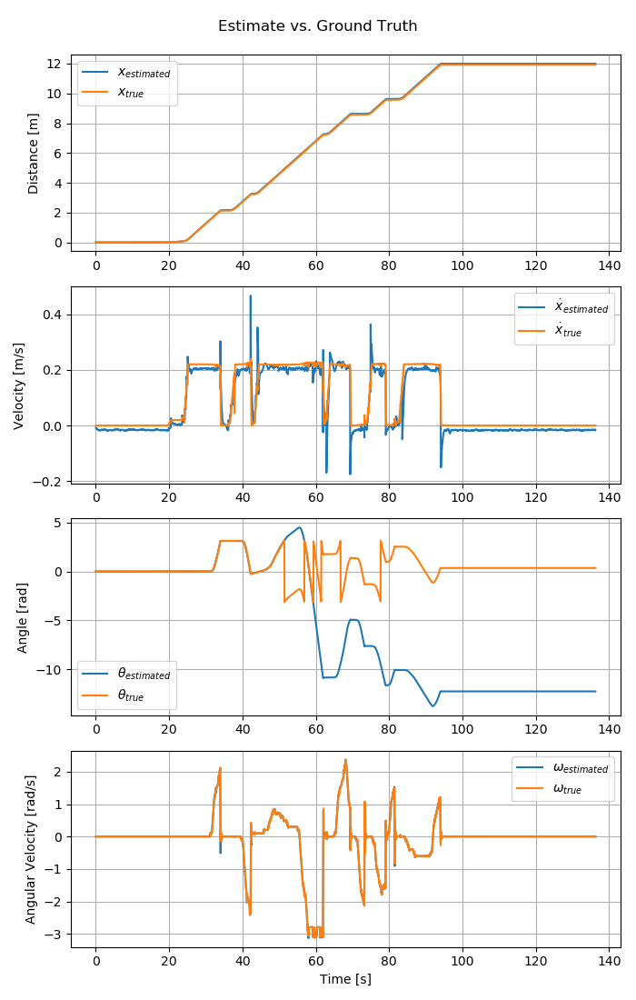
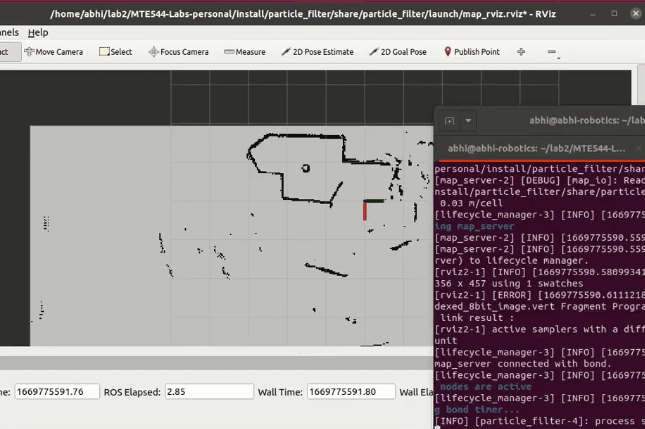

# MTE 544 Lab 2 - Particle Filter Localization

This repo a ROS2 workspace. Each folder in `src/` is a ROS2 package
- `src/kalman_filter` - Kalman Filter Localization
- `src/planner` - Motion planner and P-controller
- `src/particle_filter` - Particle Filter Localization

## Setup
To setup the packages, build and source this workspace: 

```bash
rosdep install --from-paths src --ignore-src -r -y
pip install scikit-image numpy matplotlib
colcon build --symlink-install
source install/setup.bash
```

[Notes on ROS2](./docs/ROS2_notes.md)

# Kalman Filter
This `kalman_filter` package implements a linear Kalman Filter algorithm for estimating the pose of a 2D mobile robot. It uses IMU measurements as control inputs, and wheel encoders for sensor measurements. 

See [my whitepaper report](./docs/10_Kalman_Filter_Report.pdf) for a complete explanation. 

> [Click here](https://youtu.be/7CEmD8rd0zs) for a Youtube video of the Kalman Filter in action!

In below image, the green path is ground truth, while red is the Kalamn Filter's estimate.
[](https://youtu.be/7CEmD8rd0zs)

## Running
- `ros2 launch kalman_filter kalman_filter.launch.py`
- `ros2 run turtlebot3_teleop teleop_keyboard` (when not using a rosbag)
- In RViz, click on `Publish Point` to calculate MSE and view plots

## Output on linear path

A fairly linear path, provided by a precorded rosbag.

In below image, the green path is ground truth, while red is the Kalamn Filter's estimate.




See [output folder for more plots and stats](./images/kalman_filter/output/rosbag)

## Output on nonlinear path (teleop)

Testing with a rather non-linear path. Evidently, a linear Kalman Filter is not suitable for such a path.

In below image, the green path is ground truth, while red is the Kalamn Filter's estimate.




See [output folder for more plots and stats](./images/kalman_filter/output/nonlinear_path)

## ROS Graph


## Links/Sources:
- [Turtlebot3 datasheet](https://emanual.robotis.com/docs/en/platform/turtlebot3/features/)
- [Kalman filter - Wikipedia](https://en.wikipedia.org/wiki/Kalman_filter)
- [kalmanfilter.net](https://www.kalmanfilter.net/kalmanmulti.html)
- [fjp - ROS Kalman Filter for Sensor Fusion](https://fjp.at/posts/ros/ros-kalman-filter/)
- [fjp - Kalman Filter Math Explanation, Simple English](https://fjp.at/posts/state-estimation/kalman-filter/)
- [ROS sensor fusion tutorial with Kalman Filter - Q Matrix](https://github.com/methylDragon/ros-sensor-fusion-tutorial/blob/master/01%20-%20ROS%20and%20Sensor%20Fusion%20Tutorial.md)

# Nav2 Demo

This tests out ROS2's Navigation `Nav2` stack which generates a dynamic costmap, runs the AMCL node for localization, as well as some behavioural planners.

> [Click here](https://youtu.be/_Q0Fg15VlHs) for a demo video of the ROS2 navigation stack.

[](https://youtu.be/_Q0Fg15VlHs)

- `ros2 launch turtlebot3_gazebo turtlebot3_house.launch.py`
- `ros2 launch turtlebot3_navigation2 navigation2.launch.py use_sim_time:=True map:=./src/planner/map/office_map/map.yaml`
- Now use the `2D Pose Estimate` and `Nav2Goal` functionality in RViz, and watch bevaviour of robot. 

## Links/Sources:
- [nav_msgs/msg/OccupancyGrid.msg](http://docs.ros.org/en/api/nav_msgs/html/msg/OccupancyGrid.html)
- [Published costmap topics](https://wiki.ros.org/costmap_2d#costmap_2d.2Flayered.Published_Topics)
- [Using RViz for ROS' Navigation stack](https://wiki.ros.org/navigation/Tutorials/Using%20rviz%20with%20the%20Navigation%20Stack)
- [ROS Map format](https://wiki.ros.org/map_server)
- [Setting Up Lifecycle and Composition Nodes](https://navigation.ros.org/setup_guides/lifecycle_composition/setup_lifecycle_composition.html)
- ROS2 Navigation stack intro:
    - [ROS 2 Navigation](https://ros2-industrial-workshop.readthedocs.io/en/latest/_source/navigation/ROS2-Navigation.html)
    - [Navigating with a Physical Turtlebot 3](https://navigation.ros.org/tutorials/docs/navigation2_on_real_turtlebot3.html)
    - [Getting Started](https://navigation.ros.org/getting_started/index.html)

# Lab 3 - Path planning and control

> By Abhinav Agrahari, Ayush Ghosh, and Nick Shaju

> [Original repo](https://github.com/ayushghosh21/MTE544-Labs)

This `planner` package implements an A* Planner based on a given map, and a P-controller to autonomously guide the TurtleBot along the determined path. 

> [Click here](https://youtu.be/dRcdahp3rSI) for a Youtube video of the path planner in action!

Pink/Purple/Blue is the inflated costmap. Green is the path the robot autonomously follows
[](https://youtu.be/dRcdahp3rSI)

## Running
- `ros2 launch planner planner.launch.py`
- For defining goals in RViz:
  - `ros2 run planner navigation_client.py`
  - Then in RViz, click `Publish Point` on the goal point
- For pre-defining a goal from terminal (modify x and y as needed): 
  - `ros2 run planner navigation_client.py --ros-args -p predefined_goal:=True -p goal_x:=4.0 -p goal_y:=0.8`

The `Nav2` package provides an inflated static costmap of the environment on the topic `/global_costmap/costmap` of type `nav_msgs/msg/OccupancyGrid`. We can use this in A* planning.

See [Lab3_extra_notes](./docs/06_Lab3_extra_notes.md) for more

# preLab 3

Drive around in the turtlebot3 house and visualize lidar scans:

> [Click here](https://youtu.be/IPh_0B1ZFYw) for a demo video

[](https://youtu.be/IPh_0B1ZFYw)

- `ros2 launch turtlebot3_gazebo turtlebot3_house.launch.py`
- `ros2 run turtlebot3_teleop teleop_keyboard`
- `ros2 run rviz2 rviz2 -d rviz_configs/prelab3_LaserScan.rviz`

# Lab 2 - Particle Filter Localization
> By Abhinav Agrahari, Ayush Ghosh, and Nick Shaju

> [Original repo](https://github.com/ayushghosh21/MTE544-Labs)

This `particle_filter` package implements a Particle Filter for localizing a stationary 2D mobile robot using LiDAR data against a provided map, with a `likelihood field model`.

> [Click here](https://youtu.be/S0fdMmHizCg) for a Youtube video of the particle filter in action!

Yellow arrows are the Particles, while `red` is the super-imposed LiDAR data with the origin at average pose of the particle filter.
[](https://youtu.be/S0fdMmHizCg)

## Running 

- `ros2 launch particle_filter particle_filter_launch.py`.  If you get a `Substituion Failure`, make sure the exectuable listed in the error is marked as `executable` on your file system
- Wait for the launch file to finish loading. If the map does not appear, try re-running the launch file.
- `ros2 bag play src/particle_filter/bag_files/point2` or `ros2 bag play src/particle_filter/bag_files/point5`
