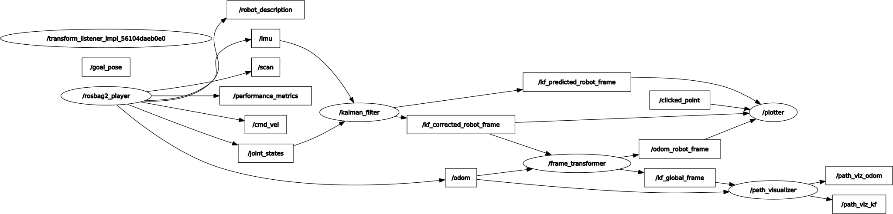

# MTE 544 Lab 2 - Particle Filter Localization
> By Group 8, Ayush Ghosh, Nick Shaju, Abhinav Agrahari
> [Original repo](https://github.com/ayushghosh21/MTE544-Labs)

This repo is itself a ROS2 workspace. Each folder in `src/` is a ROS2 package
- `src/particle_filter` - particle filter package created for Lab 2
- `src/planner` - planning package created for Lab 3

## Setup
To setup the packages, build and source this workspace: 

```bash
rosdep install --from-paths src --ignore-src -r -y
pip install scikit-image
colcon build --symlink-install
source install/setup.bash
```

## Learning ROS2 
[Ros2 Tutorials](https://docs.ros.org/en/galactic/Tutorials.html)

### tf2

> tf2 is the transform library, which lets the user keep track of multiple coordinate frames over time. tf2 maintains the relationship between coordinate frames in a tree structure.  [Source](https://docs.ros.org/en/galactic/Concepts/About-Tf2.html)

TurtleBot3 broadcasts tf transforms. In python, we can listen for these as shown [here](https://docs.ros.org/en/galactic/Tutorials/Intermediate/Tf2/Writing-A-Tf2-Listener-Py.html).

- While a rosbag is running, run `ros2 run tf2_tools view_frames`. This output the file: `./src/particle_filter/bag_files/frames.pdf`

RViz and [Foxglove Studio](https://foxglove.dev/) are  useful for viewing the association between TF frames within the ROS system: 

To output the transform between any 2 frames:
- `ros2 bag play src/particle_filter/bag_files/point2`
- `ros2 run rviz2 rviz2 -d rviz_configs/lab2_tf.rviz`

[Additional info about ROS2 tf2](https://articulatedrobotics.xyz/ready-for-ros-6-tf/)

## Lab 2 - Running the particle filter
Ensure the workspace is sourced in the terminal: `source install/setup.bash`

1. Run the launch file:

```ros2 launch particle_filter particle_filter_launch.py```

If you get a "Substituion Failure", make sure the exectuable listed in the error is marked as executable on your file system

2. Wait for the launch file to finish loading (it will take at least 2.5 seconds). A map will appear in Rviz2 and a message displaying "Ready!" will show in the terminal.

Note: If the map does not appear, try re-running the launch file.

Open a new terminal in the root of this workspace, and play the bag file:

- `ros2 bag play src/particle_filter/bag_files/point2` or `ros2 bag play src/particle_filter/bag_files/point5`

Wait a few moments for the bag file to start sending data. The particles and super-imposed lidar scan will be updated for each iteration of the particle filter.d

## preLab 3

- `ros2 launch turtlebot3_gazebo turtlebot3_house.launch.py`
- `ros2 run turtlebot3_teleop teleop_keyboard`
- `ros2 run rviz2 rviz2 -d rviz_configs/prelab3_LaserScan.rviz`

## Useful ROS commands:
- `ros2 run rqt_graph rqt_graph`
- `ros2 topic list`
- `ros2 interface show sensor_msgs/msg/LaserScan`
- `ros2 daemon stop`
- `ros2 daemon start`

## Lab 3 - Testing Nav2

This tests out ROS2's Navigation stack Nav2. Using the `2D Pose Estimate` and `Nav2Goal` functionality in RViz, we can see how ROS' Nav2 stack plans and behaves.

- First run the turtlebot simulation: `ros2 launch turtlebot3_gazebo turtlebot3_house.launch.py`
- In another terminal run the navigation stack: `ros2 launch turtlebot3_navigation2 navigation2.launch.py use_sim_time:=True map:=./src/planner/map/office_map/map.yaml`
- Now use RViz to set an initial pose and goal pose for the robot. 

When running the above, we see:
``` bash
>> ros2 topic list
...
/global_costmap/costmap
....
>> ros2 topic info /global_costmap/costmap
Type: nav_msgs/msg/OccupancyGrid
Publisher count: 1
Subscription count: 1 
```

We can subscribe to this global cost map, to get a static costmap of the environment. Nav2 will generated an 'inflated' costmap, that we can use in A* planning

### Links:
- [nav_msgs/msg/OccupancyGrid.msg](http://docs.ros.org/en/api/nav_msgs/html/msg/OccupancyGrid.html)
- [Published costmap topics](https://wiki.ros.org/costmap_2d#costmap_2d.2Flayered.Published_Topics)
- [Using RViz for ROS' Navigation stack](https://wiki.ros.org/navigation/Tutorials/Using%20rviz%20with%20the%20Navigation%20Stack)
- [ROS Map format](https://wiki.ros.org/map_server)
- [Setting Up Lifecycle and Composition Nodes](https://navigation.ros.org/setup_guides/lifecycle_composition/setup_lifecycle_composition.html)
- ROS2 Navigation stack intro:
    - [ROS 2 Navigation](https://ros2-industrial-workshop.readthedocs.io/en/latest/_source/navigation/ROS2-Navigation.html)
    - [Navigating with a Physical Turtlebot 3](https://navigation.ros.org/tutorials/docs/navigation2_on_real_turtlebot3.html)
    - [Getting Started](https://navigation.ros.org/getting_started/index.html)
- [ROS2 Launch files](https://docs.ros.org/en/foxy/How-To-Guides/Launch-file-different-formats.html)
- [ROS2 Launch Files substitution](https://docs.ros.org/en/foxy/Tutorials/Intermediate/Launch/Using-Substitutions.html)

## Lab 3 - Path planning and control

### Running

- `ros2 launch planner planner.launch.py`
- For defining goals in RViz:
  - `ros2 run planner navigation_client.py`
  - Then through RViz, give a `Publish Point`
- For pre-defining a goal from terminal (modify x and y as needed): 
  - `ros2 run planner navigation_client.py --ros-args -p predefined_goal:=True -p goal_x:=4.0 -p goal_y:=0.8`

### Notes
See [Lab3_extra_notes](./docs/06_Lab3_extra_notes.md) for more

## Final project

### Running
- `ros2 launch kalman_filter kalman_filter.launch.py`
- `ros2 run turtlebot3_teleop teleop_keyboard` # optional, when not using a rosbag
- In RViz, click on `Publish Point` when you want to calculate MSE or view plots

### Output on linear path (rosbag)
Green path is ground truth (`/odom`), red path is Kalman Filter's output


```
SAMPLE DATA POINT
Time: 12.833992352
Data format: [x x_dot theta omega]
Ground Truth: [1.52593827 0.1499646  0.20192347 0.02000288]
Prediction: [1.55294335 0.13422081 0.20561229 0.01981419]
Correction: [1.55226839 0.13202603 0.20561229 0.01981421]
MSE FOR PREDICTIONS
MSE x_{predicted}<->x_{true}: 0.0009708449765590233
MSE \dot x_{predicted}<->\dot x_{true}: 0.0007586343105548605
MSE \theta_{predicted}<->\theta_{true}: 1.914443278702474e-05
MSE \omega_{predicted}<->\omega_{true}: 8.798892218083679e-07
MSE FOR ESTIMATES
MSE x_{estimated}<->x_{true}: 0.0010141189687193778
MSE \dot x_{estimated}<->\dot x_{true}: 0.0006000109119739481
MSE \theta_{estimated}<->\theta_{true}: 1.9144424817151544e-05
MSE \omega_{estimated}<->\omega_{true}: 8.79886637556672e-07
```

### Output on nonlinear path (teleop)
Green path is ground truth (`/odom`), red path is Kalman Filter's output


```
SAMPLE DATA POINT
Data format: [x x_dot theta omega]
Time: 68.148028004
Ground Truth: [ 8.27700996  0.21383232 -0.57170808  2.35038471]
Prediction: [ 8.33310413  0.21715455 -6.78690386  2.30214477]
Correction: [ 8.33298302  0.21676019 -6.78690386  2.30214787]
MSE FOR PREDICTIONS
MSE x_{predicted}<->x_{true}: 0.002479544218576961
MSE \dot x_{predicted}<->\dot x_{true}: 0.0010987164192431524
MSE \theta_{predicted}<->\theta_{true}: 79.97616850354441
MSE \omega_{predicted}<->\omega_{true}: 0.0018624278909441833
MSE FOR ESTIMATES
MSE x_{estimated}<->x_{true}: 0.002538581397015852
MSE \dot x_{estimated}<->\dot x_{true}: 0.0008478008704528217
MSE \theta_{estimated}<->\theta_{true}: 79.97616842031054
MSE \omega_{estimated}<->\omega_{true}: 0.0018624265726317453
```
### ROS Graph

